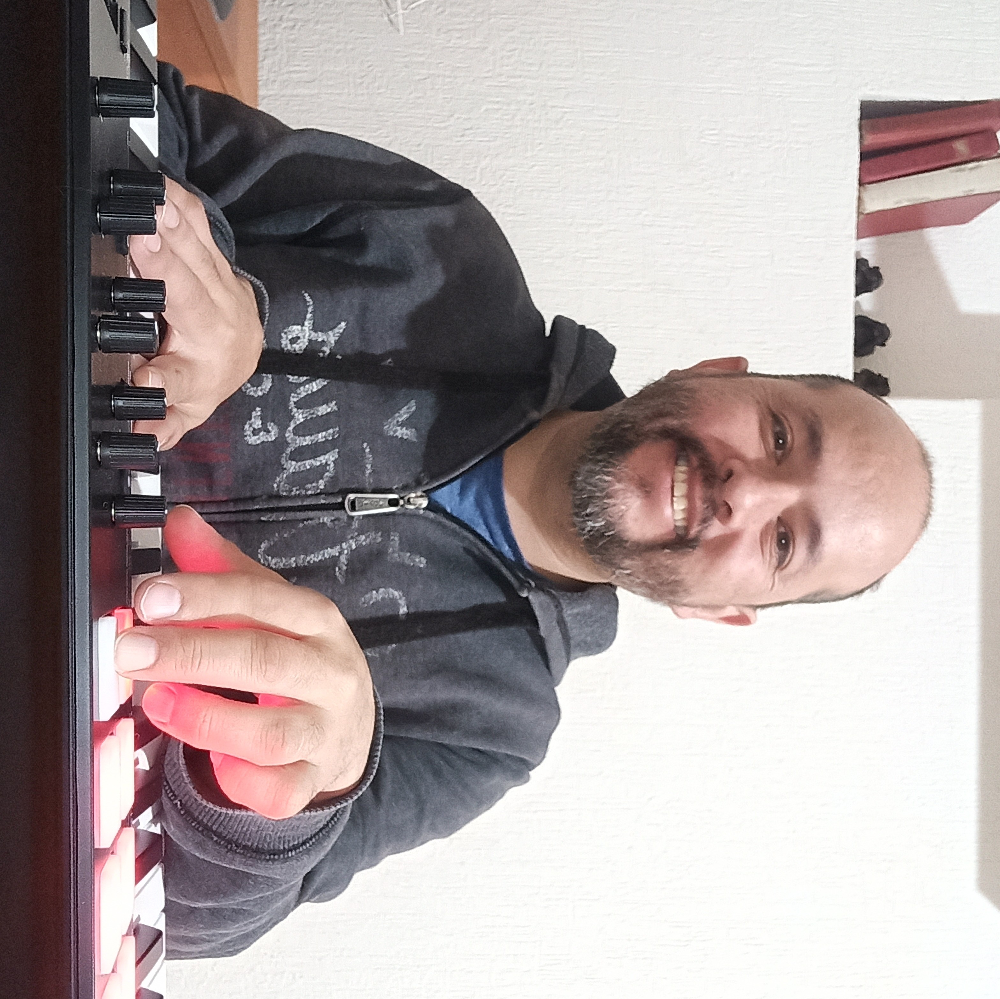

### ¿De qué se trata el curso?

Desde la antigüedad se registra el uso de aproximaciones matemáticas para estimar la solución de un problema que es difícil, imposible, o simplemente tedioso resolver de manera exacta; el **análisis numérico** es el estudio sistemático de estas aproximaciones en el contexto de la computación digital. 

Nuestro objetivo es, primero, aprender a **utilizar** estos métodos de aproximación para resolver el tipo de problemas con el que nos encontramos en los cursos de física y matemáticas, y segundo, ser capaces de **evaluar** la precisión, eficiencia y robustez de estos métodos. 

---

### El temario en Syllabus

1. Métodos de solución de ecuaciones de una variable: 
   
    1.1. Aritmética de Punto flotante

    1.2. Método de Gauss

2. Métodos de solución de una ecuación no lineal: 

	2.1. Método de bisección
	
	2.2. Método de Newton-Raphson

3. Métodos de interpolación y de ajuste de datos: 
    
	3.1. Mínimos cuadrados
    
	3.2. Aproximación de funciones con series de potencias

---

## ¿Qué espera el curso de ustedes?

1. Cálculo diferencial e integral (en una variable).
2. Álgebra lineal.
3. Ecuaciones diferenciales ordinarias. 
4. Rudimentos de programación imperativa.

Dos grandes predictores del éxito en la educación superior: una actitud flexible (i.e., disposición de cambiar lo que no funciona) y la capacidad de generar un buen ambiente de trabajo.

---

## ¿Qué pueden esperar del curso?

Al terminar el curso, deberían ser capaces (si aprobaron) de

1. Usar técnicas numéricas para aproximar las soluciones de una variedad de problemas físicos y matemáticos. 
2. Utilizar conjuntos de datos para construir modelos computacionales. 
3. Cuantificar  los errores que se presenten en la solución de problemas. 
4. Aplicar los contenidos del curso a otros cursos así como a sus problemas de investigación o desempeños profesionales. 

---

## Evaluación

Este es un punto que debemos acordar entre todos. Hay dos tipos de productos que son importantes en un curso de esta naturaleza:

1. Exámenes que demuestren la comprensión de los conceptos. 
2. Código que implemente un algoritmo o resuelva un problema específico. 

En el pasado, me he percatado de que a tantos alumnos les estresa prescindir de los exámenes como presentarlos. Sí necesitamos un mecanismo para la evaluación individual, pero no tiene que representar sufrimiento. 

---

## Integridad académica

Las reglas que rigen nuestra conducta e interacciones están codificadas en el [Código de ética e integridad académica](https://www.uaeh.edu.mx/defensor_univ/doc/2020/codigo-de-etica-e-integridad-academica-del-personal-y-el-alumnado.pdf). De particular interés:

>18.2. Las autoridades, los sindicatos, el consejo estudiantil, el alumnado y el personal, tienen el deber de inhibir y sancionar las conductas de plagio, apropiación indebida de información, citas fraudulentas, compra o intercambio de trabajos académicos, incluida la compra o intercambio de tesinas y tesis de grado, copiar en los exámenes y fraude en la presentación de las evaluaciones.

---

### El profesor

Mi oficina es la 22 (por ahora, al menos). Mi dirección de correo es [selim_gomez@uaeh.edu.mx](selim_gomez@uaeh.edu.mx). 

---

### Las herramientas

-  `git` para el control de versiones, en particular [github.com](https:///github.com). Tendrán que crear un repositorio para en él entregar el código que produzcan. 
- `Python`, en particular las librerías `numpy`, `sympy`, `pandas` y `matplotlib`. 
- `jupyter` como espacio de trabajo para producir código documentado. 
- `reveal.js` para producir presentaciones que contengan código y matemáticas. 

---

### Recomendaciones

Es imposible absorber pasivamente una habilidad como programación. 

1. Practicar, practicar, practicar
2. Aprender es relacionar algo nuevo con algo que ya conocemos: aplicar lo aprendido a otras materias. 
3. La computación en física es frecuentemente _exploratoria_. El ciclo de ensayo, error, diagnóstico y mejora es esencial para su aprendizaje.  
4. En éste curso, el tiempo del programador es más importante que el de la máquina. 

---

### Bibliografía

1. _Numerical Analysis_, L. Ridgway Scott, 2011, Princeton University Press. 
2. _Numerical Methods in Engineering with Python 3_, Jaan Kiusalaas, 2013, Cambridge University Press
3. _Introduction to Python for Science and Engineering_, David J. Pine, 2019, CRC Press. 
4. _Principles of Numerical Analysis_, Alston. S. Householder, 1955, Dover
