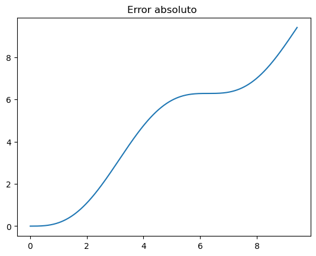
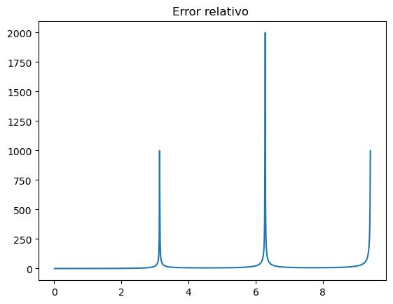

### El error es intrínseco a la física


Un cálculo numérico no está completo sin una estimación del error, que ahora  debemos cuantificar. Podemos hablar de un error verdadero (_true error_) o absoluto,

$$e_{true} = f_{true} - f_{num}, $$

y de un error relativo

$$e_{rel} = \frac{e_{true}}{f_{true}}.$$


---

Por ejemplo, cuando aproximamos $\sin \theta \approx \theta$, tenemos un error verdadero

$$ e_t = \sin\theta -\theta $$

y un error relativo

$$ e_r =\frac{ \sin\theta -\theta}{\sin\theta} $$

---


### El error absoluto tiene un punto de inflexión




---


### En el error relativo el efecto es dramático




---

### Los orígenes del error


Hay varias fuentes de error importantes:

- Error de representación
- Error de redondeo en aritmética de punto flotante


---

### Acumulación de errores

``` {.python}
def iternum(n):
    result = 1
    
    for i in range(n):
        result += 0.1

    for i in range(n):
        result -= 0.1
    return result

iternum(10000)
```


---


### Lectura sugerida

[_What Every Computer Scientist Should Know About Floating-Point Arithmetic_](https://dl.acm.org/doi/10.1145/103162.103163), David Goldberg, ACM Computing Surveys, Vol 23 1, 5–48, doi:10.1145/103162.103163.
